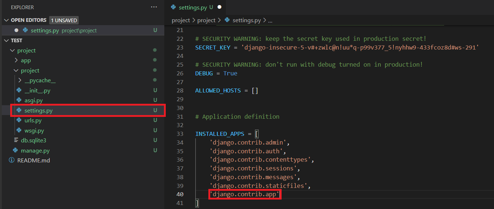

# django(windows)

 下載django
 ---

 __Anaconda虛擬環境下載:__
 ```shell

  conda install -c anaconda django

 ```

 __pip下載:__
  ```shell

   py -m pip install Django

 ```

 查看django版本
 ---


 在終端機輸入:
 ```shell 

  python -m django --version 

 ```

 創建django專案
 ---

 在終端機輸入:
 ```shell

  django-admin startproject project

 ```

 

 測試django
 ---

 cd到專案的資料夾中，然後在終端機輸入:
 ```shell

  python manage.py runserver

 ```
 
瀏覽器輸入127.0.0.1:8000在本機測試django

__成功畫面:__


在專案中新增views.py，並在此輸入以下程式碼:

```py

  from django.http import HttpResponse

  def hello(request):
     return HttpResponse("hello world")

```


url.py中新增以下程式碼:

__1:__
```py
 
  from . import views
  from django.urls import re_path as urls 

```

__2:__
```py
 
    url(r'^$',views.hello)

```


建立django app
---

cd到專案的資料夾中，然後在終端機輸入:
 ```shell

  python manage.py startapp app

 ```
 

 建立完要將app加入到settings.py中:
 

新增模板與靜態文件
---

在專案資料夾中，新增以下文件:  


