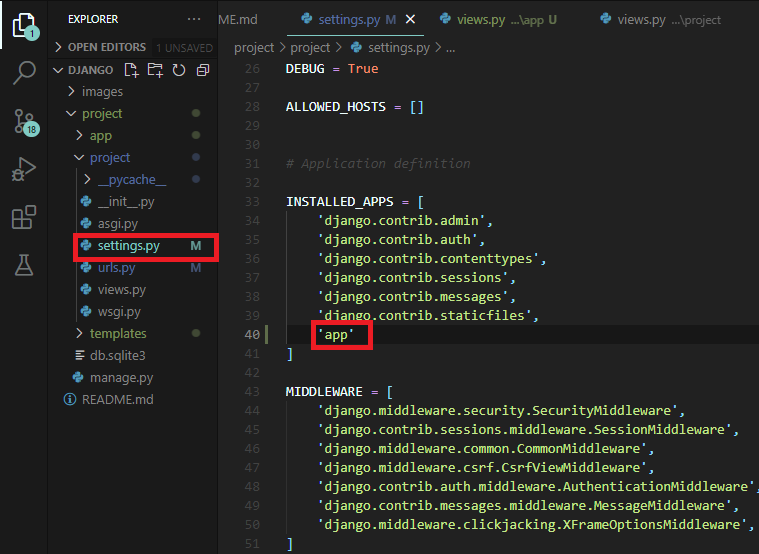

# django(windows)

# 下載django
 ---

 __Anaconda虛擬環境下載:__
```shell

conda install -c anaconda django

```

 __pip下載:__
```shell

py -m pip install Django

```

# 查看django版本


在終端機輸入:
```shell 

python -m django --version 

```

# 創建django專案


 在終端機輸入:
```shell

django-admin startproject project

```

 

# 測試django


cd到專案的資料夾中，然後在終端機輸入:
```shell

python manage.py runserver

```
--- 
瀏覽器輸入127.0.0.1:8000在本機測試django:


---
在專案中新增views.py，並在此輸入以下程式碼:
```py

from django.http import HttpResponse

def hello(request):
    return HttpResponse("hello world")

```


---
在url.py中新增以下程式碼:  
```py
 
from django.urls import re_path as url
from . import views

```
```py
 
url(r'^$',views.hello)

```


---
瀏覽器輸入127.0.0.1:8000在本機測試頁面:


---

# 新增模板與靜態文件


在專案資料夾中，新增以下文件(html檔放templates 其他靜態資料放statics):  


---
到設定檔(settings)裡新增以下程式碼:  
```py

import os

```
```py

'DIRS': [os.path.join(BASE_DIR,"templates")],

```
```py

STATICFILES_DIRS = [
    os.path.join(BASE_DIR,"statics")
]

```


---
到templates資料夾新增index.html，找一張圖片(放在statics/images資料夾裡)，並輸入以下程式碼用以測試靜態資料:  
```html

<!DOCTYPE html>
<html lang="en">
<head>
    
    <meta charset="UTF-8">
    <meta http-equiv="X-UA-Compatible" content="IE=edge">
    <meta name="viewport" content="width=device-width, initial-scale=1.0">
    <title>{{content}}</title>
    <link rel="shortcut icon" href="">
</head>
<body>
<h1>{{content}}</h1>

</html>

```


---
到專案資料夾的views.py裡把裡面程式碼改寫成:
```py

from django.shortcuts import render


def hello(request):
    return render(request, 'index.html', {
        'content': "Hello Django ",
    })

```


---
瀏覽器輸入127.0.0.1:8000在本機測試頁面:  


# 新增django app


cd到專案的資料夾中，然後在終端機輸入:
```shell

python manage.py startapp app

```
 

---
把app加到設定檔(settings.py)裡:


---
在app資料夾裡的views.py中加入以下程式碼:
```py

from django.http import HttpResponse

def index(request):
      return HttpResponse("hello app")

```


---
最後在url.py加入以下程式碼:    
```py

from app.views import index

```
```py

url(r'^app/',index)

```


---
瀏覽器輸入127.0.0.1:8000/app在本機測試頁面:


